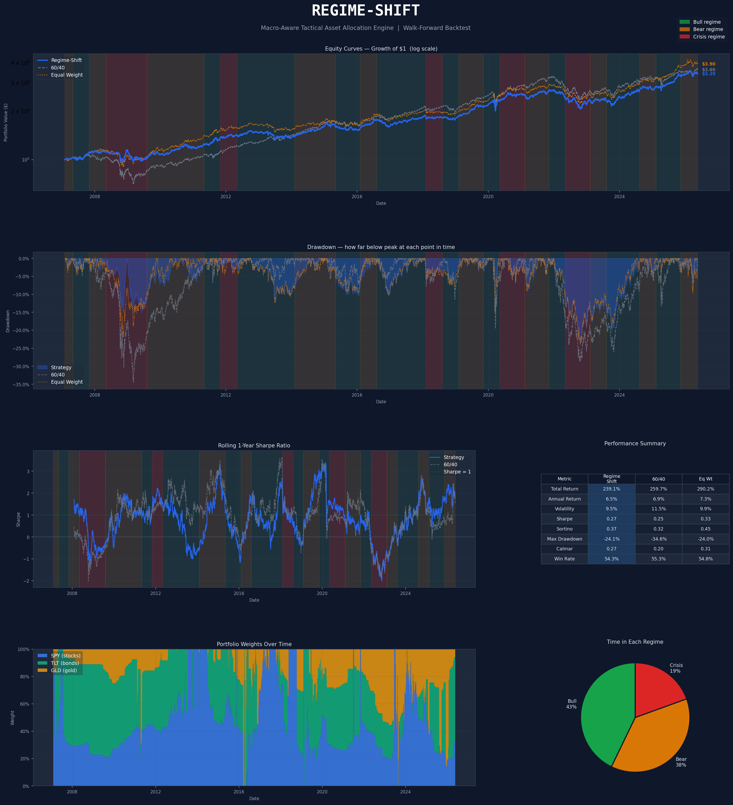

# Regime-Shift 📈
### Macro-Aware Tactical Asset Allocation Engine

A quantitative finance project that uses **Hidden Markov Models** to detect hidden market regimes (Bull / Bear / Crisis) and dynamically shifts a portfolio between stocks, bonds, and gold to improve risk-adjusted returns.

Built with a strict walk-forward validation framework — no look-ahead bias, no cheating.

---

## The Idea

Most portfolios (like the classic 60/40) use fixed weights. They assume tomorrow looks like yesterday. But markets move in *regimes* — structural modes with completely different return and volatility characteristics.

If you can detect which regime you're in, you can optimize your portfolio *for that regime* rather than for some historical average.

The problem: **you can never directly observe a regime.** You only see prices and returns. So this project builds a statistical model that *infers* the hidden regime from observable signals — and then acts on it.

---

## How It Works

```
Market Data (SPY, TLT, GLD, VIX)
           ↓
   Feature Engineering
   (returns, rolling vol, VIX, yield spread)
           ↓
   Hidden Markov Model
   (detects: Bull / Bear / Crisis)
           ↓
   Convex Portfolio Optimizer
   (Bull → Max Sharpe | Bear/Crisis → Min Variance)
           ↓
   Walk-Forward Backtester
   (retrains every 3 months, never looks ahead)
           ↓
   Performance Tearsheet
   (vs 60/40 and Equal Weight benchmarks)
```

---

## Results

| Metric | Regime-Shift | 60/40 | Equal Weight |
|---|---|---|---|
| Annual Return | 6.5% | 6.9% | 7.3% |
| Volatility | **9.5%** | 11.5% | 9.9% |
| Sharpe Ratio | **0.27** | 0.25 | 0.33 |
| Sortino Ratio | **0.37** | 0.32 | 0.45 |
| Max Drawdown | **-24.1%** | -34.6% | -24.0% |
| Calmar Ratio | **0.27** | 0.20 | 0.31 |

**The strategy beats 60/40 on every risk-adjusted metric** — lower volatility, better Sharpe, better Sortino, shallower drawdown, better Calmar. It trails on raw return because it deliberately takes less risk. For a risk-averse investor, that's the right trade-off.

---

## Tech Stack

| Tool | Role |
|---|---|
| `yfinance` | Daily price data for SPY, TLT, GLD |
| `fredapi` | Macro indicators from the Federal Reserve (VIX, yield curve) |
| `pandas / numpy` | Data manipulation and numerical math |
| `hmmlearn` | Gaussian Hidden Markov Model (regime detection) |
| `cvxpy` | Convex portfolio optimization (Sharpe max / min variance) |
| `scikit-learn` | Feature scaling (StandardScaler) |
| `matplotlib` | All charts and the final tearsheet |

---

## Project Structure

```
regime_shift/
├── data/
│   └── ingest.py              # Phase 1: pulls and cleans all data
├── models/
│   ├── hmm_regime.py          # Phase 2: trains HMM, labels every day
│   └── optimize.py            # Phase 3: regime-aware portfolio optimizer
├── backtest/
│   └── walk_forward.py        # Phase 4: honest walk-forward backtest
├── reports/
│   └── tearsheet.py           # Phase 5: final tearsheet generator
└── requirements.txt
```

---

## Setup & Run

```bash
# 1. Clone and set up
git clone https://github.com/yourusername/regime-shift.git
cd regime-shift
python -m venv venv
source venv/bin/activate  # Windows: venv\Scripts\activate

# 2. Install dependencies
pip install -r requirements.txt

# 3. (Optional) Get a free FRED API key for yield curve data
# → https://fred.stlouisfed.org/docs/api/api_key.html
export FRED_API_KEY="your_key_here"

# 4. Run all phases in order
python data/ingest.py
python models/hmm_regime.py
python models/optimize.py
python backtest/walk_forward.py   # takes ~5 minutes
python reports/tearsheet.py
```

---

## Key Concepts

**Hidden Markov Model**
The HMM assumes market returns are generated by a hidden state (regime). It learns — purely from data, with no labels — that some days cluster together as high-return/low-volatility (Bull) and others as high-VIX/negative-return (Crisis). The Viterbi algorithm then finds the single most likely sequence of hidden states across the full history.

**Convex Portfolio Optimization**
Given expected returns and a covariance matrix, cvxpy solves for the exact weight vector that maximizes Sharpe (in Bull) or minimizes variance (in Bear/Crisis). It's a quadratic program with a guaranteed global optimum — no local minima to get stuck in.

**Walk-Forward Validation**
Every 3 months, the HMM is retrained from scratch on all data up to that point. Regime detection and optimization then happen using only that model — no future data ever enters a past decision. This is the standard for honest systematic strategy evaluation.

**Why these three assets?**
SPY (stocks), TLT (bonds), and GLD (gold) have low pairwise correlations. When stocks crash, bonds and gold often hold or rise. This negative correlation is what makes regime-based reallocation meaningful — there's actually somewhere to rotate *to*.

---

## Limitations & Next Steps

- The 2013–2020 bull run exposed the model's tendency to over-detect Bear regimes when VIX stays elevated post-crisis. Adding a momentum feature would help.
- The asset universe is small (3 ETFs). Real implementations would include international equities, commodities, and REITs.
- Transaction costs are modeled as a simple penalty — in production you'd use actual bid-ask spread and market impact estimates.
- A natural extension is replacing the HMM with a Bayesian switching model or a neural network regime classifier.

---

## References

- Ang & Bekaert (2002) — *International Asset Allocation with Regime Shifts*
- Guidolin & Timmermann (2007) — *Asset Allocation under Multivariate Regime Switching*
- DeMiguel et al. (2009) — *Optimal Versus Naive Diversification* (the 1/N paper)
- Baum-Welch Algorithm — standard EM approach for HMM parameter estimation
